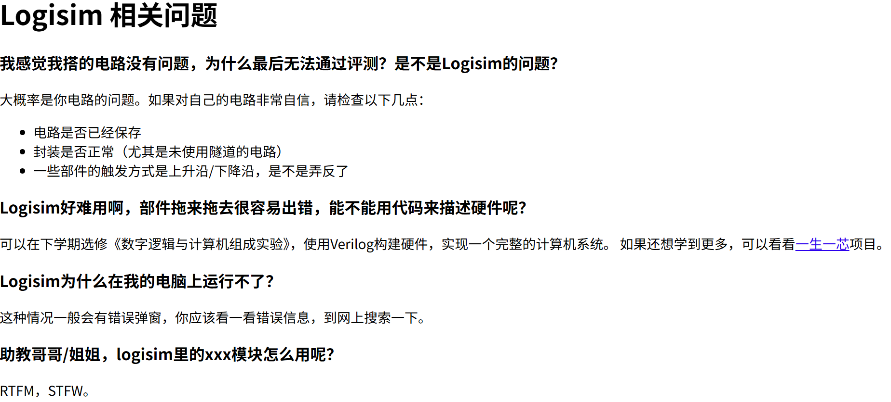

# 2026 Spring NJU DLCO LABS CODE AND REPORTS

这是2026年春南京大学数字逻辑和计算机组成课程实验的个人实现，仅供参考，其中部分内容**可能并不完全准确**。

我个人更希望你能独立思考，并产生更加简洁优雅的设计；但是如果你对这门课实在没有多大热情，或者对某些知识的理解还不够深入，那么这些内容也许能帮到你。

## TO LEARNERS

**请不要直接将整个仓库克隆到本地/实验平台提交！**

如果你对实验中某些端口的用法感到困惑，我在几乎每个实验的实验报告的开头都提供了“端口定义”，可以作为启发思考的一环。

如果你对电路的设计和连接感到难以下手，我在每个实验的实验报告中都提供了“实验电路图/原理图”，可以作为参考的实现（不过有些实现为了简洁，可能不那么直观）。

如果你对填写表格感到厌倦，我这里也提供了某些实验的测试表格，可作参考。（然而，这些表格的内容可能在验收时会要求当场填写，建议提前熟悉一下）

如果你有某个实验总是无法通过，我在“错误分析”部分提供了我在实验过程中遇到的一些细节错误和解决方法，或许能帮你少走一些弯路。不过更推荐在实验遇到困难时多和同学和助教交流。

实验讲义中有一些内容表述可能不太清晰，或者在设计电路时会遇到一些细节问题，这些都需要你自己去摸索和理解。多多和同学助教交流，或者在网上搜索相关的资料，都是很好的学习方法。

总之，**希望这个仓库的内容可以提升你的学习体验，祝你顺利通过这门课！**

## SOME RESOURCES

关于如何使用logisim进行电路设计，你不能指望老师或助教一步一步指导，需要自行摸索。放一张往年助教/老师提供的FAQ截图：

实验报告的撰写也是这门课不得不品的一环。如果你对如何撰写实验报告感到迷茫，可以参考[这个说明](https://nju-dl-co-ta.github.io/DLCOdoc/report/)。下面我给出我的实验报告的得分，根据上课经验，这个得分和助教个人的评分标准有很大关系，因此**仅供各位参考**：

| 实验 | 得分（满分100）                      |
| ---- | ------------------------------------ |
| 1    | 80（可能是没有给出实验原理图的原因） |
| 2    | 90                                   |
| 3    | 100                                  |
| 4    | 100                                  |

吐槽完毕。下面是我个人觉得非常有用的资源：

- [Logisim官方文档](https://cburch.com/logisim/docs/2.6.0/en/libs/index.html)：完整包含各种组件的详细说明、端口定义和使用方法，（Logisim甚至提供了命令行工具，这对自动化测试很有帮助）建议在设计电路时随时参考。
- [USTC Logisim教程](https://vlab.ustc.edu.cn/guide/doc_logisim.html)：提供了基础的Logisim使用教程，适合初学者入门。
- [汉堡助教的帮助文档](https://dlco.bakaburger.com/)：提供了基础的操作技巧和每个实验可能踩到的坑，建议在遇到困难时先查看这里。

> Logisim虽然有在持续维护的版本，但是依然不可避免的会出现各种奇怪的bug。当你遇到这些问题时，可以重开电路图文件，或者重置实验环境。同时建议在本地进行设计和测试，最后再上传到实验平台提交，这样可以降低电路丢失的风险。
> 我们有同学研究过如何在实验平台上使用git进行同步，但是需要配置校内DNS和git仓库，某些班级可能略显麻烦。可以参考[这篇博客](https://blog.xmzheng.cn/posts/git-tutorial-for-dlco/) ~~（甚至可以在实验平台上打开实验平台）~~ 。比较简单的办法是使用实验平台提供的上传、下载文件功能，可以在右上角工具栏按钮中找到。

下面是一些我觉得比较有用或者有意思的资源：

- [circuitikz](https://ctan.org/pkg/circuitikz)：如果你需要在实验报告中绘制电路图，circuitikz是一个非常强大的LaTeX包，可以帮助你绘制专业的电路图。当然，手绘也可以，实验报告的评分标准中并没有要求电路图必须使用某种工具绘制，**只要清晰易懂即可**。
- [TuringComplete](https://turingcomplete.game/)：这是一款非常有趣的游戏，你会从基础的逻辑门开始，逐渐构建出一个完整的计算机系统。它的上手难度不高，而且有比较丰富的wiki，~~如果你不想学，~~ 可以体验一下这个游戏，或许能激发你对数电的兴趣。
- [《编码：隐匿在计算机软硬件背后的语言》](https://awesome-programming-books.github.io/computer-system/%E7%BC%96%E7%A0%81%EF%BC%9A%E9%9A%90%E5%8C%BF%E5%9C%A8%E8%AE%A1%E7%AE%97%E6%9C%BA%E8%BD%AF%E7%A1%AC%E4%BB%B6%E8%83%8C%E5%90%8E%E7%9A%84%E8%AF%AD%E8%A8%80.pdf)：这是一本通俗易懂的计算机系统科普书籍，涵盖了从硬件到软件的各个层面，主题脉络非常清晰，而且善于使用各种类比辅助理解抽象的硬件和概念，适合对计算机系统有兴趣但没有太多背景知识的读者，可以作为补充阅读材料。
- [《计算机组成与设计：硬件/软件接口》](https://zh.z-lib.sk/book/Z5QnJdNv9a/%E8%AE%A1%E7%AE%97%E6%9C%BA%E7%BB%84%E6%88%90%E4%B8%8E%E8%AE%BE%E8%AE%A1%E7%A1%AC%E4%BB%B6%E8%BD%AF%E4%BB%B6%E6%8E%A5%E5%8F%A3%E5%8E%9F%E4%B9%A6%E7%AC%AC5%E7%89%88riscv%E7%89%88.html)：这是一本经典的计算机组成原理教材，内容详实，涵盖了从基本的逻辑门到复杂的处理器设计的各个方面。虽然内容比较深入，但对于想要系统学习计算机组成原理的同学来说是非常有价值的资源。
- 各类AI工具：现在的AI虽然不能直接生成完整的电路设计（至少我学习此课的时代如此），但可以帮助你理解一些概念，或者在你卡住的时候提供一些电路实现上的启发。亲测[Google AI Studio](https://aistudio.google.com/)提供的Gemini系列模型在理解和生成数字电路的设计思路上表现不错，我的实现中很多自以为“妙”的做法都是它告诉我的，非常推荐一试。

最后，记得看一下每个lab中的README（如果有的话），其中会包含一些对仓库内容的说明。
