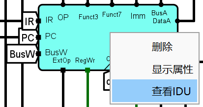
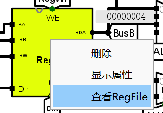
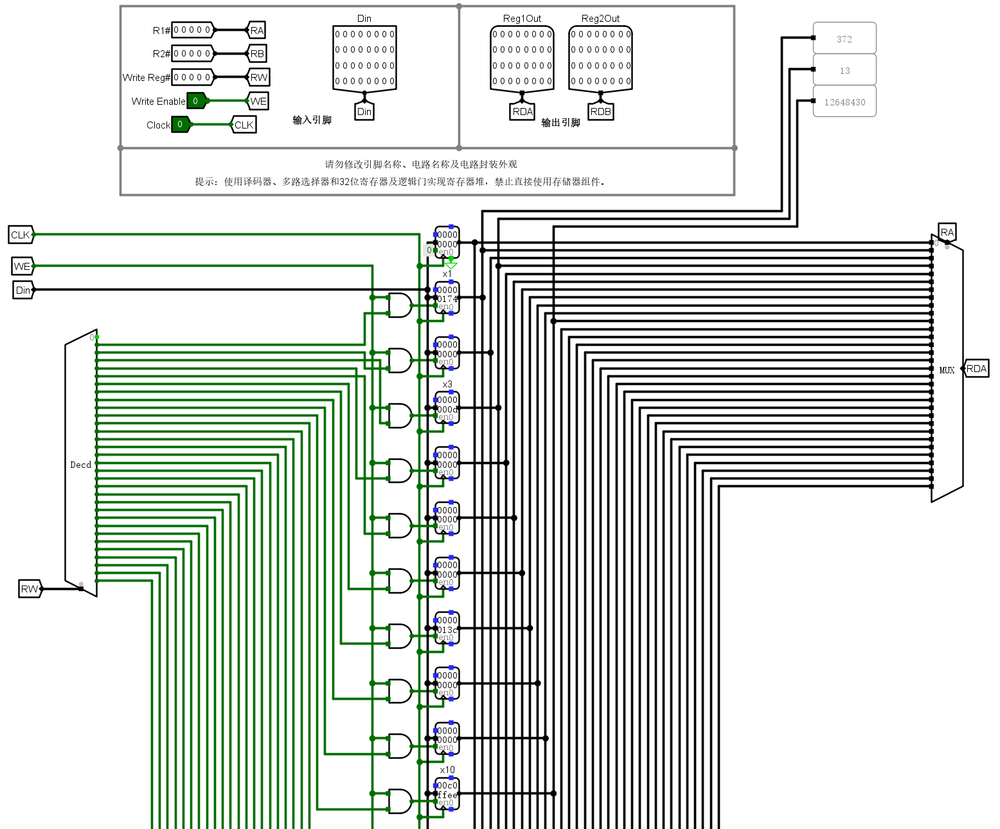

# ABOUT THIS LAB

这个实验需要手动设计的其实只有两个实验：控制器和单周期CPU的设计，另外的实验都是在进行测试，`testcase`和`C Test`都是测试文件夹，内部包含测试文件。
考虑到需要测试的指令和程序众多，我编写了一个自动化测试脚本`autotest.sh`(适用于bash)、`autotest.py`(适用于Python 3.10+)和 ~~又臭又长的~~ `autotest.ps1`(适用于pwsh7，由copilot生成)。但是由于无法直接从circ文件修改RAM的值，而Logisim的命令行工具也无法单独修改RAM的值，因此`C Test`中的所有测试和`testcase`中的部分`Load`、`Store`命令测试还是没有很好的办法实现方便的自动化，如果有同学想出了什么好办法希望能够在issue区里分享一下。

## ABOUT autotest

参考链接：

- [Logisim-ITA的命令行工具](https://cburch.com/logisim/docs/2.6.0/en/guide/verify/index.html)
- [一篇博客](https://foreveryolo.top/posts/6588/index.html)

### REQUIREMENTS

- Bash shell (for `autotest.sh`)
- PowerShell 7 (for `autotest.ps1`)
- Python 3.10+ (for `autotest.py`)
- **Logisim-ITA.jar** (for running the tests) **注意是jar文件！**
- 目录树：
    ```
    lab6
    ├── autotest.sh
    ├── autotest.ps1
    ├── Logisim-ITA.jar
    ├── lab6.5.circ # 仓库提供的测试电路图文件
    ├── testcase  # 课程提供的测试文件夹，不需要手动编译
    │   ├── rv32ui-p-add.hex
    │   ├── rv32ui-p-addi.hex
    │   ├── ...
    ```

### USAGE

首先，你需要对你的电路图进行一些修改，使其能够适配自动化测试脚本。具体的修改方案在实验报告中有写，这里不再赘述。需要将修改后的电路图保存为`lab6.5.circ`（这是在脚本中硬编码的），并放在与`autotest.sh`和`autotest.ps1`同一目录下。

然后在终端中输入如下命令：

```bash
# 进入lab6目录
cd path/to/lab6
# 对于bash用户
./autotest.sh
# 对于PowerShell用户
.\autotest.ps1
# 使用Python脚本
python autotest.py
```

脚本会自动运行`lab6.5.circ`中的test电路图，并依次用`testcase`文件夹中的测试文件替换原有指令存储器的值进行测试。

测试结果输出在`result.txt`中格式如下：

```txt
<测试文件名> : <32位x10寄存器的值> <32位x3寄存器的值> <32位x1寄存器的值> <1位测试是否通过的标志位> <16位cycle值>
```

例如：

```txt
rv32ui-p-add.hex : 0000 0000 1100 0000 1111 1111 1110 1110  0000 0000 0000 0000 0000 0000 0010 0110  0000 0000 0000 0000 0000 0000 0001 0000 1 0000 0001 1100 1010
rv32ui-p-addi.hex : 0000 0000 1100 0000 1111 1111 1110 1110 0000 0000 0000 0000 0000 0000 0001 1001 0000 0000 0000 0000 0000 0000 0010 0001 1 0000 0000 1110 1011
```

若是Python脚本，输出在result_py.txt中，格式如下：

```txt
测试指令 	 & RS2转发次数 	 & RS1转发次数 	 & 分支指令数 	 & 跳转指令数 	 & 冲刷次数 	 & 阻塞次数 	 & 总周期数 	 & 是否通过 
add & 120 & 84 & 68 & 0 & 16 & 0 & 493 & Passed
```

如果测试没有通过，标志位是0，否则为1；并设置了100秒最大测试时间，如果显示`Testing xxx.hex Timeout`，说明测试没有在100秒内完成，大概率是电路设计有问题导致死循环。

Logisim-ITA的命令行工具在Windows下运行速度可能较慢，建议在Linux环境下运行测试脚本，或者使用WSL（Windows Subsystem for Linux）来运行测试脚本。**更推荐使用Python脚本。**
第一次运行通常会很慢，可以多试几次。`Load`和`Store`指令的测试需要手动输入，这个脚本测量出来的不准。

## ABOUT OJ

这个实验中其实后面三个实验使用的都是同一张电路图，不同的是加载的数据和指令文件不同。需要注意的是，如果你需要Reset你的CPU，你需要在ReSet=1下经过一个时钟沿后再将ReSet拉回0。

实验四在提交时，需要将DataRAM中的初始值设为lab6.4_d.hex0~lab6.4_d.hex3的值，并且将指令存储器中的初始值设为lab6.4_tst.hex的值。实验三在提交时，需要将指令存储器中的初始值设为lab6.3-tst.hex的值。

## ABOUT HOW TO VIEW INNER REGISTER VALUES

如果你想在测试过程中查看CPU内部寄存器的值，直接在左边查看子电路**可能**行不通。这时需要在主电路中右键你的IDU，点击“查看IDU”，然后会跳到CPU电路中真正的IDU电路中，然后再右键你的寄存器堆，点击“查看Regfile”，就可以在这里看到寄存器的值了。或者双击显示在组件上的放大镜图标也可以直接跳转到子电路中。







## ABOUT PINS AND TUNNELS

设计电路时，注意引脚的问题，因为后续老师修改了引脚和隧道的名称，如果你直接复制我的设计，可能会导致一些问题。仔细检查隧道和引脚的名称能不能对的上！

## ABOUT THE CONTROLLER

**我的控制器的设计相当丑陋，不建议效仿**，老师课上的PPT应该有更好的实现方法。

## ABOUT THE CHECK

验收需要填写一张表格，已经给出。填写表格所需数据均在`testcase`和`RV32I`中，需要注意所谓的“数据存储器地址”和Logisim中DataRAM的地址并不是一个概念。
